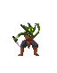
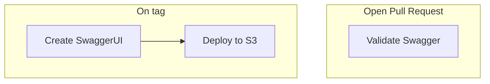

<!-- PROJECT LOGO -->
<br />
<div align="center">
  <a href="https://github.com/sudoblark/monsternames.open-api">
    
  </a>

<h3 align="center">monsternames.open-api</h3>

  <p align="center">
    OpenAPI definiton for the monsternames RESTAPI
  </p>
</div>


<!-- TABLE OF CONTENTS -->
<details>
  <summary>Table of Contents</summary>
  <ol>
    <li>
      <a href="#about-the-project">About The Project</a>
      <ul>
        <li><a href="#built-with">Built With</a></li>
      </ul>
    </li>
    <li><a href="#getting-started">Getting started</a></li>
    <li>
      <a href="#local-development">Local development</a>
      <ul>
        <li><a href="#validating-openapi-definition">Validating OpenAPI definition</a></li>
        <li><a href="#running-swaggerui">Running SwaggerUI</a></li>
      </ul>
    </li>
    <li><a href="#ci-cd-setup">CI/CD Setup</a></li>
    <li><a href="#contributing">Contributing</a></li>
    <li><a href="#license">License</a></li>
    <li><a href="#acknowledgments">Acknowledgments</a></li>
  </ol>
</details>


<!-- ABOUT THE PROJECT -->
## About The Project
This repo defines our OpenAPI definition for monsternames, and - via CI/CD - publishes
the SwaggerUI static website for monsternames.

<p align="right">(<a href="#readme-top">back to top</a>)</p>


### Built With

* [Swagger](https://swagger.io)
* [OpenAPI specification 3.1.0](https://swagger.io/specification/)
* [Docker](https://hub.docker.com)
* [NPM](https://www.npmjs.com)

<p align="right">(<a href="#readme-top">back to top</a>)</p>


<!-- GETTING STARTED -->
## Getting Started

1. Read the OpenAPI specification if you haven't already
2. Make changes to the specification 
3. Submit a pull request
4. Check the produced SwaggerUI artefact in the pipeline 
5. Once merged to main, the deployment will happen for you :)


<!-- LOCAL DEVELOPMENT -->
## Local Development
The below instructions are to assist local development of the OpenAPI definition and/or
SwaggerUI.

All instructions, unless otherwise stated, were only tested on MacOS.

### Validating OpenAPI definition

1. Install [swagger-cli](https://apitools.dev/swagger-cli/) from NPM:
```sh
npm install -g @apidevtools/swagger-cli
```
2. Validate:
```sh
swagger-cli validate open-api.yaml
```

### Running SwaggerUI

1. Clone the swagger-ui docker image:
```sh
docker pull swaggerapi/swagger-ui
```

2. Run it, mounting our local `open-api.yaml` file:

```
docker run -it \
    --mount type=bind,source="$(pwd)"/open-api.yaml,target=/usr/share/nginx/html/open-api.yaml \
    -p 8080:8080 \
    -e API_URL=open-api.yaml \
    swaggerapi/swagger-ui
```

3. Navigate to `localhost:8080` to see the swaggerUI


<p align="right">(<a href="#readme-top">back to top</a>)</p>


f<!-- CI/CD -->
## CI/CD setup




<!-- CONTRIBUTING -->
## Contributing

If you have a suggestion that would make this better, please fork the repo and create a pull request. You can also simply open an issue with the tag "enhancement".
Don't forget to give the project a star! Thanks again!

1. Fork the Project
2. Create your Feature Branch (`git checkout -b feature/AmazingFeature`)
3. Commit your Changes (`git commit -m 'Add some AmazingFeature'`)
4. Push to the Branch (`git push origin feature/AmazingFeature`)
5. Open a Pull Request

<p align="right">(<a href="#top">back to top</a>)</p>

<!-- LICENSE -->
## License

Copyright (c) 2023, Sudoblark Ltd

All rights reserved.

This source code is licensed under the BSD 3 clause license found in the
LICENSE file in the root directory of this source tree. 

<p align="right">(<a href="#readme-top">back to top</a>)</p>


<!-- ACKNOWLEDGMENTS -->
## Acknowledgments

* [Monster Creatures Fantasty](https://luizmelo.itch.io/monsters-creatures-fantasy) by luizmelo for the wonderful logo